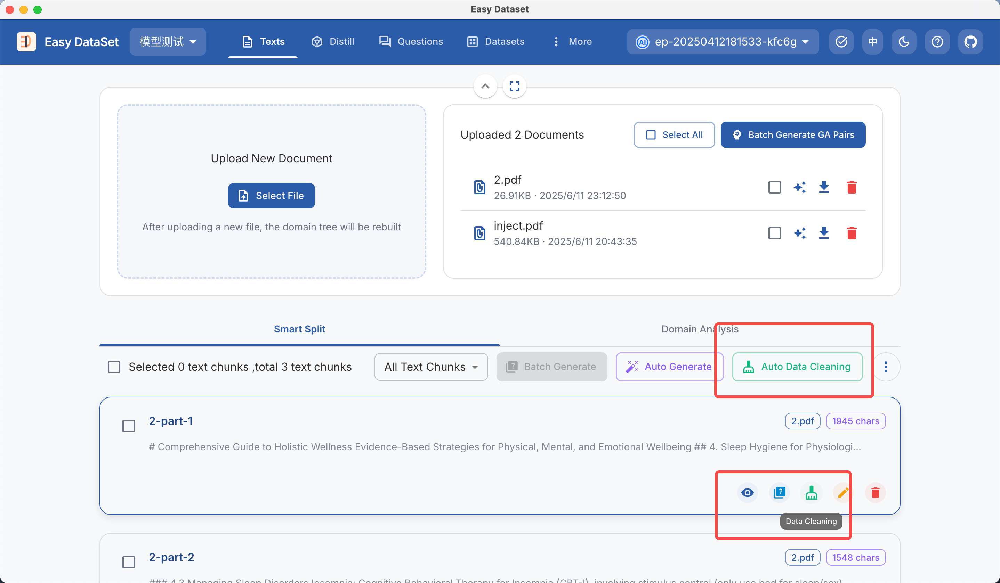

# MGA 增强数据集

数据增强面临的问题

当前，大模型的训练高度依赖训练数据的规模与质量，但现实往往面临着两大矛盾：

1. **数据稀缺性**：高质量语料（如学术文献、专业文本）总量有限，公开数据集（如 C4、RefinedWeb ）经严格过滤后仅保留不到 `10%` 的原始内容，难以支撑模型的持续扩展和训练。
2. **重复退化问题**：在传统深度学习中，重复训练是可以继续提升模型性能的，但 `LLM` 训练中，过度重复会导致模型泛化能力下降、优化稳定性变差，尤其是参数规模超千亿的模型。

> 例如，当使用 `1950` 亿 tokens 的高质量数据训练 130 亿参数模型时，若直接重复 10 次，模型在推理任务（如 GSM8K 数学题）的准确率会下降 23%，验证损失上升 `17%`。这表明：**数据重复并非简单的“量的补充”，而是需要质的多样性重构**。

### 字节最新论文

字节跳动 Seed 团队最近发表了一篇论文：《`Reformulation for Pretraining Data Augmentation`》

其中提出了一种新的 **Massive Genre-Audience（MGA）** 方法，通过轻量级框架将现有语料系统重构为多样化变体，核心思路是：**基于不同 “体裁（Genre）” 和 “受众（Audience）” 生成内容变体，在保留核心知识的同时创造语义丰富的新数据**。

虽然论文主要是表述预训练的数据集增强，但其思路同样适用于在模型微调阶段的数据集构造。

### MGA 介绍

“`Massive Genre-Audience`”（大规模类型-受众）是论文中提出的 `MGA（Massive Genre-Audience Reformulation）` 方法的核心概念，其含义可从以下两方面具体理解：

<figure><figcaption></figcaption></figure>

#### “Massive”的含义

* **大规模的多样性生成**：指该方法通过系统设计，能够生成海量的内容变体。例如，论文中提到每次推理会生成 5 对“类型-受众”组合，使原始文档扩展为 5 个新文档，实现 3.9 倍的 Token 数扩展。
* **覆盖广泛的场景**：强调其适用于大规模语料库的扩展，解决数据稀缺和重复问题，支持模型在数十亿参数规模下的高效训练。

#### “Genre-Audience”的含义

* **Genre（类型）**： 指内容的“知识表达框架”，通过多个维度定义，包括：
  * **沟通目的**（如教育、分析、叙事）；
  * **内容结构**（如分步教程、学术论文、对话体）；
  * **语言风格**（如严谨学术风、通俗故事风）；
  * **知识深度**（如初学者入门、专业研究者深度分析）。\
    例如，将同一篇科普文章重构为“学术论文”或“儿童故事”，会采用不同的结构和语言风格，但保留核心知识。
* **Audience（受众）**： 指内容的目标读者群体，结合以下特征：
  * **人口统计学因素**（年龄、职业、教育背景，如“12-15岁中学生”“医学专业研究生”）；
  * **知识背景与动机**（如“对化学感兴趣的初学者”“需要教学素材的中学教师”）。\
    例如，针对“办公室工作人员”的急救指南会侧重实用性和通俗表达，而针对“医学生”的版本则会包含更多专业术语和深度理论。

#### MGA方法的核心逻辑

* **通过“类型-受众”对驱动内容多样性**：每个“类型-受众”组合定义了一种重构方向，使同一原始文本能以不同形式呈现（如将科学知识转化为面向儿童的故事、面向学者的分析报告等），从而避免数据重复，增强模型对不同场景的泛化能力。
* **轻量级与可扩展性**：利用小模型自适应生成“类型-受众”对，无需依赖100亿参数以上的大型模型，降低计算成本，适合大规模语料库扩展。

> `“Massive Genre-Audience”` 本质上是一种数据增强策略，通过系统化地生成海量“类型-受众”组合，将现有文本重构为多样化的变体，既保留核心信息，又覆盖不同表达形式和读者群体，对模型训练数据进行增强，从而提升模型性能。

### MGA 的技术实现

在该论文中，MGA 的技术实现分为三个关键步骤：

* **阶段1：Genre-Audience对生成**\
  利用 3.3B 参数的混合专家模型（MoE），从原始文档中自适应提取5组不同的体裁-受众组合。例如，一篇科普文章可被映射为 `“学术论文-科研人员”、“对话体-老年人”、“教科书-中学生”` 等组合，每个组合定义内容的表达框架（如结构、语言风格、知识深度）和受众特征（如年龄、教育背景、专业领域）。
* **阶段2：文本重构**\
  使用量化后的轻量级工具模型，根据每对 `Genre-Audience` 的要求重构文本。例如，将 “气候变化” 原始文本重构为面向小学生的对话体故事时，会简化术语、增加具象案例；重构为学术报告时，则强化数据论证和理论框架。
* **质量控制：Limited Consistency准则**\
  引入 LLM 裁判模型，以 “有限一致性” 为标准评估重构文本：允许风格、表达顺序的差异，但要求核心信息可追溯至原始文本。例如，若重构文本丢失所有原始信息点或语义偏差过大，则判定为无效（评分<3）。

论文中的框架将 `1950亿 tokens` 的 `FineWeb-Edu` 数据集扩展为 `7700亿 tokens` 的 `MGACorpus`，`token` 数量扩大 `3.9` 倍，且每个原始文档生成5个语义不同的变体。

相比现有数据增强方案（如 `Phi-4、Cosmopedia`），MGA 的核心优势在于：

* **不依赖超大模型**：无需 120 亿参数以上的生成模型（如GPT-4），仅用 `3.3B MoE` 模型即可实现高质量重构，计算成本降低 40%。
* **免复杂种子系统**：传统方法需预定义种子模板（如QA对、维基风格），而 `MGA` 直接从原始文本动态生成 `Genre-Audience` 对，避免人工设计的局限性。
* **平衡多样性与保真度**：通过 `prompt` 工程调节“信息保留”与“内容变异”的权衡。例如，严格模式（`SLM-Strict`）要求 `80%` 以上核心信息保留，适合知识密集型任务；宽松模式（`SLM-Relaxed`）允许更多创意扩展，适合泛化能力训练。

### MGA 的实证效果

实验表明，使用 `MGA` 思路增强的数据集训练模型，在数据受限场景下显著优于传统方案：\

跨模型规模的一致性提升：在13亿到130亿参数模型中，`MGA-Expansion` 方案较原始数据训练的基线模型：

* **推理任务**（如TriviaQA、GSM8K）准确率提升 `2.03%-15.47%`，例如17亿参数模型在 `GSM8K` 的解题率从 `7.81%` 提升至 `13.87%`；
* **知识任务**（如 `MMLU-Pro` ）得分提升 `2.15%`，表明多样化重构帮助模型捕捉知识的多维度表达；
* **抗重复能力**：当原始数据重复10次时，基线模型验证损失上升0.25，而MGA处理后损失仅上升0.08。

与其他合成数据的对比：对比 `Cosmopedia、Nemotron` 等方案，`MGA` 在 `377M` 参数模型上的平均性能（37.28）超越 Cosmopedia（35.57）和多数 Nemotron 策略（如“知识提取”35.72）。其核心原因在于：

* **Genre-Audience驱动的多样性**：每个原始文本生成5种不同体裁和受众的变体，如“医学指南”可重构为“医生学术报告”“患者科普手册”“医学院教材”等，覆盖不同语言风格和知识深度，避免合成数据的模式坍塌。
* **领域适应性**：在数学（Open-Web-Math）、编程（Python-Edu）等专业领域，MGA 重构数据使 17 亿参数模型的验证损失分别降低 0.12 和 0.09，而传统重写方法（如WRAP）效果有限。

### 为什么 MGA 能提升模型学习效率？

MGA 的有效性源于对 LLM 学习机制的三点优化：

1. **对抗数据重复导致的“记忆偏差”**：原始数据重复会使模型过度记忆特定表达形式（如网页模板、固定句式），而MGA通过体裁变异（如从说明文到对话体）打破这种模式，迫使模型学习抽象语义。例如，在FineWeb-Edu数据中，原始文本结尾常包含“选择网站”的标准化提示，重复训练会使模型在该位置的预测损失降低22%，但MGA重构后，模型在该类噪声位置的损失反而上升，表明其更关注内容本身而非格式。
2. **促进“泛化性学习”而非“特异性记忆”**： 实验发现，使用MGA数据训练的模型在真实数据（如FineWeb-Edu）上的验证损失略高，但在外域任务（如ARC科学推理）上表现更优。这是因为模型优先学习跨体裁的通用模式，而非记住特定数据集的分布特征。
3. **缓解“合成数据坍塌”问题**：传统合成方法易因种子模板有限导致数据分布偏移（如QA对格式同质化），而MGA通过动态生成Genre-Audience对，使合成数据的嵌入分布与原始数据保持重叠但扩展（如t-SNE可视化中，Base模型生成的变体既覆盖原始数据簇，又延伸至新区域）。

### 在 Easy Dataset 中使用 MGA 对数据集进行增强

在 Easy Dataset 1.3.6 版本中，引入了上述论文中提到的 MGA 数据增强方案。

我们正常创建一个用于测试 MGA 的新项目：

<figure><figcaption></figcaption></figure>

配置好模型后，在文献处理模型上传一些文献：

<figure><figcaption></figcaption></figure>

默认情况下，直接生成问题和数据集不会采用 MGA 增强方案。

我们可以针对特定需要启用 MGA 的文献来生成 `Genre（类型）、Audience（受众）` （GA）对：

<figure><figcaption></figcaption></figure>

GA 对可以由 AI 自动生成（基于文献关键内容进行提取），也可以手动添加：

<figure><figcaption></figcaption></figure>

选择 AI 自动生成，会默认生成 5 个 GA 对：

<figure><figcaption></figcaption></figure>

你可以对自动生成的 GA 对进行选择启用，自定义变更，或者删除操作：

<figure><figcaption></figcaption></figure>

点击保存后，文献列表处将展示文献已经生成的 GA 对：

<figure><figcaption></figcaption></figure>

如果文献较多，你也可以选择为所有文献批量生产 GA 对。

对于已生成 GA 对的文献，可选择是追加模式还是覆盖模式：

<figure><figcaption></figcaption></figure>

生成完成后，点击文献列表处的 GA 标签，依然可以查看文献的 GA 详情：

<figure><figcaption></figcaption></figure>

在文献启用 MGA 模式（已经生成了 GA 对）后，后续再基于该文献构造问题和数据集都将基于文献下的所有 GA 进行生成：

<figure><figcaption></figcaption></figure>

在默认 240 字符生成一个问题的设置下，对于 1500 字左右的文本块，基础模式下将生成 6 个问题，但是在生成了 5 个 GA 的情况下将生成 30 个问题。

<figure><figcaption></figcaption></figure>

> 注意：启用 MGA 模式后生成的问题和数据集数量相比之前会成倍增长，所以会消耗更多的 Token，以及使数据集生成速度变慢。

例如在幽默科普型（对技术感兴趣的中学生）GA 下：

<figure><figcaption></figcaption></figure>

生成的一个数据集样例为：

<figure><figcaption></figcaption></figure>
